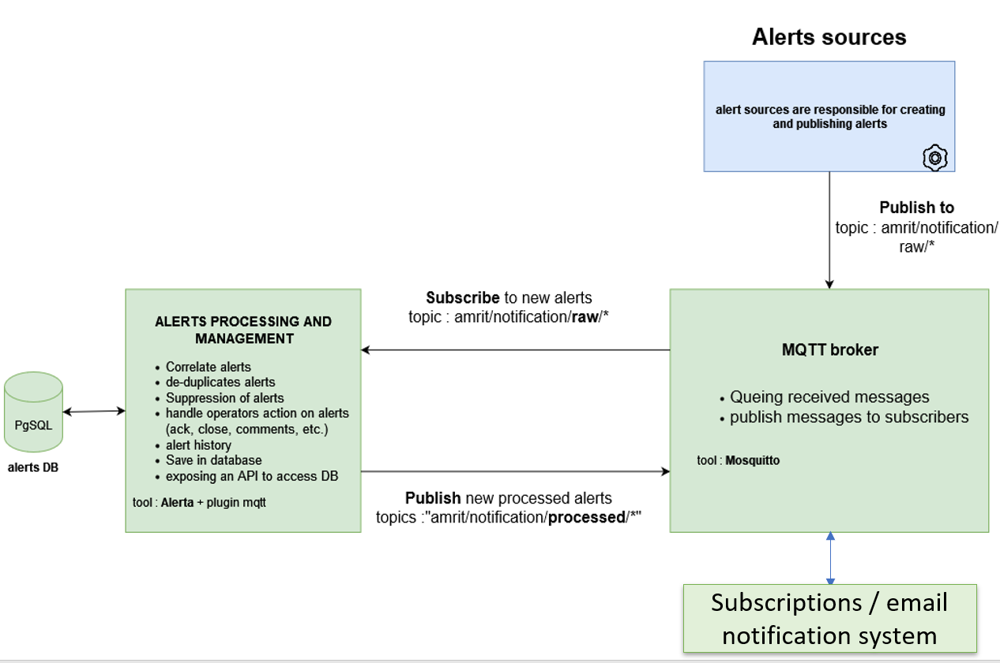

# notifications center
The AMRIT notification center is based on a modified [ALERTA](https://alerta.io/) system, a PostgreSQL database and a MQTT broker. 
- Alerta is an open-source alert management system that enables alert correlation and deduplication, management of operator actions on alerts (acknowledgement, closure, addition of comments, deletion), recording of alerts in a database, and provision of an API for viewing and managing these alerts.
- The MQTT broker alows user to publish alerts on a 'amrit/notification/raw/#' topic which will be automatically taken into acount by Alerta, processed and published back on MQTT by Alerta to a 'amrit/notification/processed/#' topic. This allows other systems to subscribes to 'amrit/notification/processed/#' and received in real time new alerts. For example a notification system with emails developped with AMRIT is subscribed to 'amrit/notification/processed/#' and send emails to users according to their preference.

It is also possible to send alerts to Alerta directly using the [Alerta's API](https://docs.alerta.io/api/reference.html). Alerta will automatically publish it back to the MQTT once the alert has been processed. This same API can also be used to consult alerts database and do action. 

In the AMRIT environment, Alerta is used throughout the [AMRIT Gateaway and Dashboard](https://github.com/amrit-eu/amrit-dashway).



## Deploy the notification center

You should use Docker to deploy Notification center because in this repo, only some alerta modified python files are provided and this files are copied during the build process with Docker. You could also clone the [Alerta github repository](https://github.com/alerta/alerta) and replace manually the python files.

A docker compose file is provided to launch 3 services : custom alerta, posgreSQL and mosquitto MQTT broker.
You will need an environment file to define expected environment variable. You can use the demo one `.env.demo` by renaming it in `.env`.

```bash
docker compose up
```
or to force Amrit-alerta build:

```bash
docker compose up --build
```
The default alerta UI is then accessible at `http://localhost:8000/`. You can log in using admin user & password defined in .env file.

## Publish Alerts on notification center
### Using MQTT broker
The preferred way to publish alert is to send a cloudEvent message to the MQTT broker. The message must respect the schema defined in the file `cloudEvent_alerta_raw.schema.json` where the alert payload is in the data attribute.
You must publish the message to the topic `amrit/notification/raw/`.
Four sub-topics has been defined for the notification center to  better categorise alerts and allow other systems to subscribe only to certain types of alerts :
- `amrit/notification/raw/operations-alerts`
- `amrit/notification/raw/data-management`
- `amrit/notification/raw/information`
- `amrit/notification/raw/support-requests`

The python [alrit-mqtt-publisher](./amrit-mqtt-publisher/) is provided to help you to publish alerts on the MQTT. This python program handle the creation of the cloudEvent message alongs with alert format verification and handle the client connection to MQTT and publish message. Please see the [Readme.md](./amrit-mqtt-publisher/README.md) for mor information

### Using Alerta's API
You can also use directly the [Alerta's API](https://docs.alerta.io/api/reference.html) to POST alerts. You will need API key you can create using the alerta UI admin menu.


## Consult Alerts from notification center
### Using Amrit Dashboard
Please consult [Wiki](https://github.com/amrit-eu/notifications-center-docs/wiki) menu to know how to consult all alert from the system, act on it and manage user subscriptions.

### Using ALerta API
Retrieve and act on alerts using [Alerta's API](https://docs.alerta.io/api/reference.html).

### Subscribe to the "processed" MQTT topic.
After an alert is received by Alerta (from MQTT or from API), alerta process it (deduplication, add attribute, history, save to database), the eenriched alert is publish back to the topic `amrit/notification/processed/#` (one of the 4 sub-topic). It allows other system to subscribe to theses "processed" topics and be informed in real time when new alerts has been received by the system.
For example the [AMRIT Gateaway](https://github.com/amrit-eu/amrit-dashway) is subscribed to `amrit/notification/processed/#` and send email to users and web notification to the Amrit Dashboard using websocket.

### Default Alerta UI
You can use the default alerta UI at `http://localhost:8000/`

## Mqtt broker configuration

##### Main configuration file : [`mosquitto.conf`](./mqtt-broker/mnt/config/mosquitto.conf)

Documentation : <https://mosquitto.org/man/mosquitto-conf-5.html>

Configuration file for querying the broker via the **Websocket** protocol with secure access. The Websocket protocol was chosen over the MQTT protocol because it will be easier to deploy on Ifremer's Dockerised platforms.

##### Configuration file for user : [`passwd_file`](./mqtt-broker/mnt/config/passwd_file)

In the case of a broker with secure access, change the `mosquitto.conf`file, put `allow_anonymous false` and de-comment 
`acl_file /mosquitto/config/acl_file
 password_file /mosquitto/config/passwd_file` 
then define a list of users in the password file.

- Commands to define, for example, two test users :

```bash
# create new password file with RO user
docker exec -it mosquitto mosquitto_passwd -c /mosquitto/config/passwd_file amrit-nc-test-ro

# Adding an RW user
docker exec -it mosquitto mosquitto_passwd -c /tmp/create_user_file amrit-nc-test-rw
docker exec -it mosquitto sh -c "cat /tmp/create_user_file >> /mosquitto/config/passwd_file"
docker exec -it mosquitto rm /tmp/create_user_file

# deleting a user
docker exec -it mosquitto mosquitto_passwd -D /etc/mosquitto/passwd user

```
##### Configuration File for topic access : [`acl_file`](./mqtt-brokemnt/config/acl_file)

In the case of a broker with secure access, the **access control list** file is used to define which users can access which topics.

- Commands to define access rights to a topic for test users:

```bash
docker exec -it mosquitto sh -c "echo 'user amrit-nc-test-rw' >> /mosquitto/config/acl_file"
docker exec -it mosquitto sh -c "echo 'topic readwrite origin/nc/amrit/test' >> /mosquitto/config/acl_file"


docker exec -it mosquitto sh -c "echo 'user amrit-nc-test-ro' >> /mosquitto/config/acl_file"
docker exec -it mosquitto sh -c "echo 'topic read origin/nc/amrit/test' >> /mosquitto/config/acl_file"
```

## Custom Alerta precision
### Modifications made
This is the Alerta system (API + Web UI), slightly modified:

- MQTT → ALERTA: Addition of a service running alongside Alerta: MqttToAlerta_service. This service subscribes to the MQTT broker (general topic 'amrit/notification/raw/#') and whenever a CloudEvent message containing an Alerta-type payload is received, the service forwards the alert to Alerta.

- ALERTA → MQTT: Addition of an Alerta plugin that forwards alerts to an MQTT broker after Alerta has processed them (database storage, deduplication, etc.). This is not a separate service but a built-in plugin managed by Alerta: [Alerta plugins documentation](https://docs.alerta.io/plugins.html)

- JWT AUTH: Addition of a new authentication method: the /auth/bearer route accepts a JWT token ('Authorization: Bearer [token]' header). The token must contain at least the following fields: "sub" (email address), "name" (user name), "exp" (token expiration date), "contactId" (unique user identifier). For roles, the token must contain the "roles" field. By default, the token is simply decoded to create/update a user in the database. Indeed, this custom Alerta system is intended to be used within the AMRIT framework, where JWT authentication/verification is handled upstream by the AMRIT "API Gateway". However, JWT verification can be enabled by providing the public JWKS endpoint in the alertad.conf file. Example:

``
VERIFY_JWT_JWKS_ENDPOINT='http://amrit-gateway:3000/api/oceanops/auth/.well-known/jwks.json'
``

- Addition of a fix on an Alerta system file not yet merged into the main branch on GitHub: https://github.com/alerta/alerta/pull/2020
- Change to the action performed when an alert expires: the alert is now closed ('close') rather than set to 'expired' status (alerta/models/alert.py line 692). Additionally, "closed" alerts are not subject to expiration (alerta/database/backends/postgres/base.py line 129). This allows an expired alert received again to generate a new alert.
- Addition of an alerts/events endpoint to list events in the database.
- Addition of an alerts/resources endpoint to list resources in the database.
- Modification of the built-in 'reject' plugin so that alert validation follows the alert schema defined for AMRIT (certain mandatory attributes such as Country and alert_category).

**Warning: the modifications have only been applied for a PostgreSQL database.**
### Installation 
The Docker image build uses the official image in its latest version ('FROM alerta/alerta-web'). The following files are then added/overwritten in the container:

- 2 .py files (bearer.py and __init__.py) for JWT authentication handling.
- The MQTT plugin files and its installation.
- The MqttToAlerta service is copied. This service requires a supervisord configuration to be launched alongside the other native Alerta services. To achieve this, an entrypoint.sh file is needed. This file runs the native Alerta docker-entrypoint.sh so that the Alerta supervisord.conf configuration file is properly created, and then the MqttToAlerta-specific configuration is appended to the native Alerta supervisord.conf.

The Dockerfile is provided.

### Generate python class models.py from JSON schemas :
Installdatamodel-code-generator :

```
pip install datamodel-code-generator

```
Whenever a JSON schema is changed (Alert_raw.schema.json, Alert_processed.schema.json, cloudEvent_alerta_raw.schema.json, cloudEvent_alerta_processed.schema.json), the corresponding Python model files (*.*py) must be regenerated from the JSON schema. Models need to be generated for both Python codebases (/plugins/mqtt using the "processed" model & mqtt_to_Alerta_service using the "raw" model) : 

```
datamodel-codegen --input cloudEvent_alerta_raw.schema.json --input-file-type jsonschema --output-model-type pydantic_v2.BaseModel --use-unique-items-as-set --class-name CloudEventAlertaRaw --output alerta/mqtt_to_Alerta_service/models

datamodel-codegen --input cloudEvent_alerta_raw.schema.json --input-file-type jsonschema --output-model-type pydantic_v2.BaseModel --use-unique-items-as-set --class-name CloudEventAlertaRaw --output alerta/amrit_custom_alerta_patch/alerta/plugins/models


datamodel-codegen --input cloudEvent_alerta_processed.schema.json --input-file-type jsonschema --output-model-type pydantic_v2.BaseModel --use-unique-items-as-set --class-name CloudEventAlertaProcessed --output alerta/plugins/mqtt/models
```
